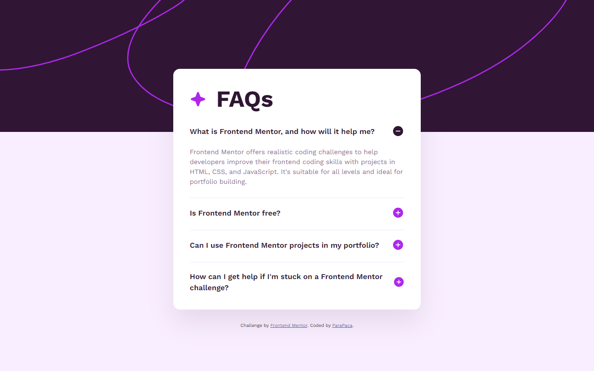

# Frontend Mentor - FAQ accordion solution

This is a solution to the [FAQ accordion challenge on Frontend Mentor](https://www.frontendmentor.io/challenges/faq-accordion-wyfFdeBwBz). Frontend Mentor challenges help you improve your coding skills by building realistic projects. 

## Table of contents

- [Overview](#overview)
  - [The challenge](#the-challenge)
  - [Screenshot](#screenshot)
  - [Links](#links)
- [My process](#my-process)
  - [Built with](#built-with)
  - [What I learned](#what-i-learned)
  - [Continued development](#continued-development)
  - [Useful resources](#useful-resources)
- [Author](#author)

**Note: Delete this note and update the table of contents based on what sections you keep.**

## Overview

### The challenge

Users should be able to:

- Hide/Show the answer to a question when the question is clicked
- Navigate the questions and hide/show answers using keyboard navigation alone
- View the optimal layout for the interface depending on their device's screen size
- See hover and focus states for all interactive elements on the page

### Screenshot



### Links

- Solution URL: [Add solution URL here](https://your-solution-url.com)
- Live Site URL: [Add live site URL here](https://your-live-site-url.com)

## My process

### Built with

- Semantic HTML5 markup
- Flexbox
- Mobile-first workflow
- [SCSS](https://sass-lang.com/) - CSS extension
- [JQuery](https://jquery.com/) - JS library

### What I learned

**Navigating the Depths of JQuery**
Beyond the conventional use of JQuery, this project encapsulates an exploration of its nuanced functionalities. It's not just about creating animations; it's about deciphering the library's potential to sculpt dynamic and captivating user interfaces.

**Fine-tuning Responsive Design**
I perceive media queries and dynamic viewport units not merely as tools but as pivotal components in crafting adaptive, responsive interfaces. This signifies not just a skill but a profound comprehension of responsive design principles.

**Learning Advanced CSS Selectors**
This project acts as a crucible for refining my skills in handling advanced CSS selectors. It goes beyond mere usage, delving into a comprehensive understanding of their intricate behaviors, resulting in more efficient and concise styling.

```css
.article-wrapper:not(:last-child) {
  border-bottom: 2px solid #f9f0ff;
  padding: 0 0 26px;
  margin-bottom: 20px;
}
```
```js
//hide every paragraph, except current
container.find(".article-wrapper p").not(paragraph).slideUp(500);

//finds every accordion button, except current, removes class minus and adds class plus
container.find(".accordion").not(accordion).removeClass("minus").addClass("plus");

accordion.toggleClass("minus plus");
paragraph.slideToggle(500);
```

### Continued development

The journey continues with a commitment not only to deepen my grasp of JQuery but also to infuse my projects with elements that reflect not just technical acumen but the artistic nuances of web development.

### Useful resources

- [JQuery Documentation](https://api.jquery.com/category/manipulation/) - This helped me understand the jquery methods and write the code that initializes the animation for the title and paragraph open button.
- [W3Schools](https://www.w3schools.com/) - Always helping me, when I'm stuck in my projects for different reasons.

## Author

- Website - [ParaPaca](https://github.com/ParaPaca)
- Frontend Mentor - [@ParaPaca](https://www.frontendmentor.io/profile/ParaPaca)
- Twitter - [@ParaPaca](https://www.twitter.com/ParaPaca)
