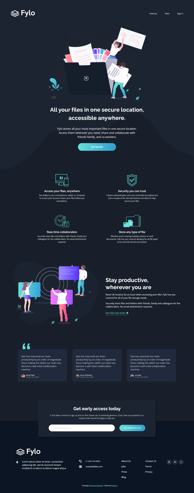

# Frontend Mentor - Fylo dark theme landing page solution

This is a solution to the [Fylo dark theme landing page challenge on Frontend Mentor](https://www.frontendmentor.io/challenges/fylo-dark-theme-landing-page-5ca5f2d21e82137ec91a50fd). Frontend Mentor challenges help you improve your coding skills by building realistic projects. 

## Table of contents

- [Overview](#overview)
  - [The challenge](#the-challenge)
  - [Screenshot](#screenshot)
  - [Links](#links)
- [My process](#my-process)
  - [Built with](#built-with)
  - [What I learned](#what-i-learned)
  - [Continued development](#continued-development)
  - [Useful resources](#useful-resources)
- [Author](#author)

## Overview

### The challenge

Users should be able to:

- View the optimal layout for the site depending on their device's screen size
- See hover states for all interactive elements on the page

### Screenshot



### Links

- Solution URL: [https://github.com/ParaPaca/frontend-mentor/tree/main/Fylo-dark-theme-landing-page](https://github.com/ParaPaca/frontend-mentor/tree/main/Fylo-dark-theme-landing-page)
- Live Site URL: [https://parapaca.github.io/frontend-mentor/Fylo-dark-theme-landing-page/](https://parapaca.github.io/frontend-mentor/Fylo-dark-theme-landing-page/)

## My process

### Built with

- Semantic HTML5 markup
- CSS custom properties
- Flexbox
- CSS Grid

### What I learned

This project seemed a little easier to me than my previous landing page layout experience (link). Here I applied all the knowledge and skills acquired from the previous case, as well as newly acquired ones:

- CSS grid and flex - I continue to practice using them in more complex cases. I'm far from perfect yet, but it seems like I'm already doing pretty well.

- clamp() - I continue to use this function for better understanding and training.

- HTML file structure - I continue to devote more time to the structure of my projects so that it corresponds to the features of semantic layout.

- BEM methodology - I began to adhere to the BEM methodology and follow the recommendations for writing and using CSS classes.

- popover - Thanks to this project, I learned about such a fairly new attribute as popover (currently not available only for Firefox). It can be used to designate an element as a popup window element. I used this attribute on a button that, when clicked, pops up a window with links in the page header. The button appears only at 20rem of viewport width and less.

- position property - I continue to practice this property to achieve better results.

```scss
#popover-links-list:popover-open {
  position: absolute;
  content: "";
  border-radius: .375rem;
  background-color: rgba(hsl(176, 68%, 64%), 0.98);
  top: 3.75rem;
  left: 60%;
  width: 6.25rem;
  height: 6.25rem;
  font-size: 1rem;
  display: flex;
  flex-direction: column;
  gap: .625rem;
  padding: .625rem .3125rem;
  align-items: center;
  justify-content: center;

  a {
    color: #000;
    font-weight: 500;
  }
}
```

### Continued development

I will continue to focus on the above and will also continue to take on more challenging projects.

### Useful resources

- [W3Schools](https://www.w3schools.com/) - Always helping me, when I'm stuck in my projects for different reasons.
- [MDN](https://developer.mozilla.org/en-US/) - Also very useful site.
- [CSS-TRICKS](https://css-tricks.com/) - A lot of useful CSS-tricks.

## Author

- Website - [ParaPaca](https://github.com/ParaPaca)
- Frontend Mentor - [@ParaPaca](https://www.frontendmentor.io/profile/ParaPaca)
- Twitter - [@ParaPaca](https://www.twitter.com/ParaPaca)