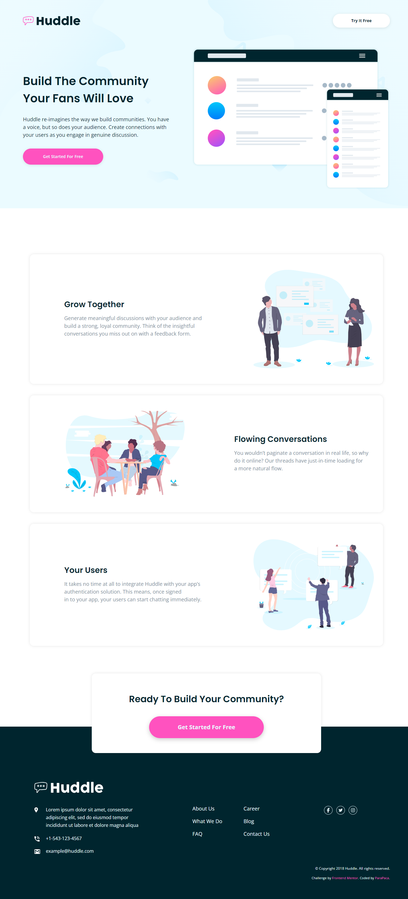

# Frontend Mentor - Huddle landing page with alternating feature blocks solution

This is a solution to the [Huddle landing page with alternating feature blocks challenge on Frontend Mentor](https://www.frontendmentor.io/challenges/huddle-landing-page-with-alternating-feature-blocks-5ca5f5981e82137ec91a5100). Frontend Mentor challenges help you improve your coding skills by building realistic projects. 

## Table of contents

- [Overview](#overview)
  - [The challenge](#the-challenge)
  - [Screenshot](#screenshot)
  - [Links](#links)
- [My process](#my-process)
  - [Built with](#built-with)
  - [What I learned](#what-i-learned)
  - [Continued development](#continued-development)
  - [Useful resources](#useful-resources)
- [Author](#author)

## Overview

### The challenge

Users should be able to:

- View the optimal layout for the site depending on their device's screen size
- See hover states for all interactive elements on the page

### Screenshot

### Links

- Solution URL: [https://github.com/ParaPaca/frontend-mentor/tree/main/Huddle-landing-page-with-alternating-feature-blocks](https://github.com/ParaPaca/frontend-mentor/tree/main/Huddle-landing-page-with-alternating-feature-blocks)
- Live Site URL: [https://parapaca.github.io/frontend-mentor/Huddle-landing-page-with-alternating-feature-blocks/](https://parapaca.github.io/frontend-mentor/Huddle-landing-page-with-alternating-feature-blocks/)

## My process

### Built with

- Semantic HTML5 markup
- CSS custom properties
- Flexbox
- CSS Grid
- SCSS

### What I learned

First of all, I would like to say that at the time of writing this readme file, this project was the most difficult for me of all that I had done previously (in frontend-mentor and outside of it). Despite the fact that the level of this project is equal to JUNIOR, for me it turned out to be about a level more difficult.

This case was a challenge for me. In it, I was able to apply the knowledge gained in the process of creating previous projects on frontend-mentor, namely:

- HTML file structure - I started to devote more time to the structure of my projects so that it corresponds to the features of semantic layout.

- BEM methodology - I began to adhere to the BEM methodology and follow the recommendations for writing and using CSS classes.

- Classes - with each new project I try to simplify the structure of writing styles more and more. I began to overuse style nesting less, and also began to understate the specificity of classes as much as possible for better interaction with them.

- CSS custom properties - I began to use custom properties more often, but at the same time I remember not to abuse them.

- clamp() - I managed to delve deeply into the study of this function. It laid the foundation for my understanding of the max() and min() functions.

- Position property - I still practice using this property in my projects, and also make sure not to overdo it.

### Continued development

I will continue to focus on the above and will also continue to take on more challenging projects.

### Useful resources

- [W3Schools](https://www.w3schools.com/) - Always helping me, when I'm stuck in my projects for different reasons.
- [MDN](https://developer.mozilla.org/en-US/) - Also very useful site.
- [CSS-TRICKS](https://css-tricks.com/) - A lot of useful CSS-tricks.

## Author

- Website - [ParaPaca](https://github.com/ParaPaca)
- Frontend Mentor - [@ParaPaca](https://www.frontendmentor.io/profile/ParaPaca)
- Twitter - [@ParaPaca](https://www.twitter.com/ParaPaca)
