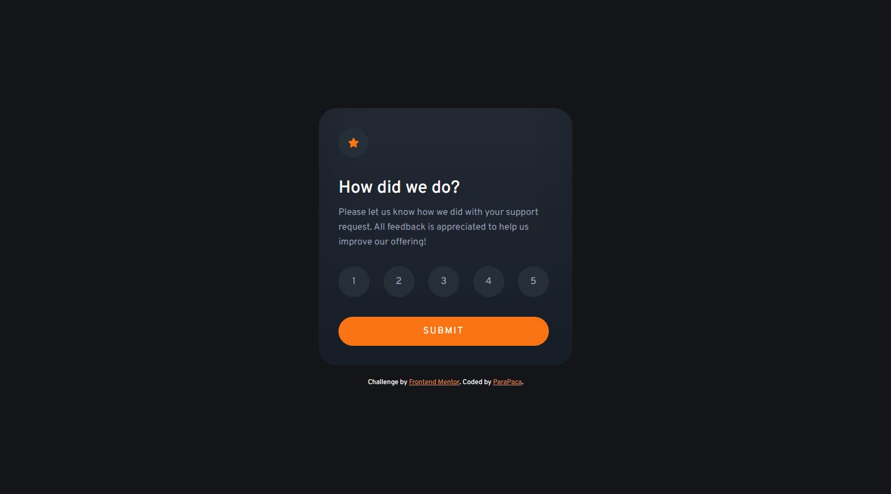

# Frontend Mentor - Interactive rating component solution

This is a solution to the [Interactive rating component challenge on Frontend Mentor](https://www.frontendmentor.io/challenges/interactive-rating-component-koxpeBUmI). Frontend Mentor challenges help you improve your coding skills by building realistic projects. 

## Table of contents

- [Overview](#overview)
  - [The challenge](#the-challenge)
  - [Screenshot](#screenshot)
  - [Links](#links)
- [My process](#my-process)
  - [Built with](#built-with)
  - [What I learned](#what-i-learned)
  - [Useful resources](#useful-resources)
- [Author](#author)

## Overview

### The challenge

Users should be able to:

- View the optimal layout for the app depending on their device's screen size
- See hover states for all interactive elements on the page
- Select and submit a number rating
- See the "Thank you" card state after submitting a rating

### Screenshot

### Links

- Solution URL: [https://github.com/ParaPaca/frontend-mentor/tree/main/Interactive-rating-component](https://github.com/ParaPaca/frontend-mentor/tree/main/Interactive-rating-component)
- Live Site URL: [https://parapaca.github.io/frontend-mentor/Interactive-rating-component](https://parapaca.github.io/frontend-mentor/Interactive-rating-component)

## My process

### Built with

- Semantic HTML5 markup
- CSS custom properties
- Flexbox
- CSS Grid
- Mobile-first workflow
- SCSS
- Vanilla JS (and commented JQuery)

### What I learned

This project became additional practice for me in using clamp and writing JS code.

### Useful resources

- [W3Schools](https://www.w3schools.com/) - Always helping me, when I'm stuck in my projects for different reasons.
- [MDN](https://developer.mozilla.org/en-US/) - Also very useful site.

## Author

- Website - [ParaPaca](https://github.com/ParaPaca)
- Frontend Mentor - [@ParaPaca](https://www.frontendmentor.io/profile/ParaPaca)
- Twitter - [@ParaPaca](https://www.twitter.com/ParaPaca)
