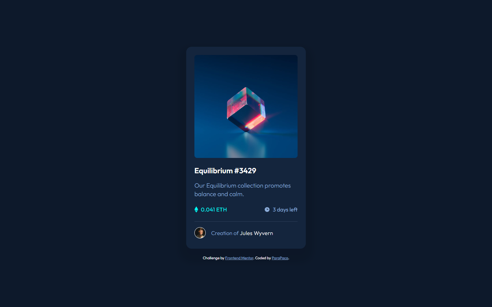

# Frontend Mentor - NFT preview card component solution

This is a solution to the [NFT preview card component challenge on Frontend Mentor](https://www.frontendmentor.io/challenges/nft-preview-card-component-SbdUL_w0U). Frontend Mentor challenges help you improve your coding skills by building realistic projects. 

## Table of contents

- [Overview](#overview)
  - [The challenge](#the-challenge)
  - [Screenshot](#screenshot)
  - [Links](#links)
- [My process](#my-process)
  - [Built with](#built-with)
  - [What I learned](#what-i-learned)
  - [Continued development](#continued-development)
  - [Useful resources](#useful-resources)
- [Author](#author)
- [Acknowledgments](#acknowledgments)

## Overview

### The challenge

Users should be able to:

- View the optimal layout depending on their device's screen size
- See hover states for interactive elements

### Screenshot



### Links

- Solution URL: [https://github.com/ParaPaca/frontend-mentor/tree/main/NFT-preview-card-component](https://github.com/ParaPaca/frontend-mentor/tree/main/NFT-preview-card-component)
- Live Site URL: [https://parapaca.github.io/frontend-mentor/NFT-preview-card-component](https://parapaca.github.io/frontend-mentor/NFT-preview-card-component)

## My process

### Built with

- Semantic HTML5 markup
- CSS custom properties
- Flexbox
- CSS Grid
- Mobile-first workflow
- SCSS

### What I learned

While working on this component, I finally managed to figure out position absolute. Now I will use this property more freely.

This project also became additional practice for me in using clamp.

```scss
.nft-img {
  background: url(./images/image-equilibrium.jpg) no-repeat top center / 100%;
  height: clamp(272px, 60vw, 302px);
  position: relative;
  border-radius: 8px;
  overflow: hidden;

  &::before {
    content: "";
    position: absolute;
    top: 0;
    left: 0;
    width: 100%;
    height: 100%;
    background-color: rgba($cyan, 0.5);
    opacity: 0;
    transition: opacity 0.2s ease-in-out;
  }

  &::after {
    content: url(./images/icon-view.svg);
    position: absolute;
    top: 50%;
    left: 50%;
    transform: translate(-50%, -50%);
    opacity: 0;
    transition: opacity 0.2s ease-in-out;
  }

  &:hover {

    &::before,
    &::after {
      opacity: 1;
    }
  }
}
```

### Continued development

In subsequent projects I will pay more detailed attention to positioning and such a relatively new method for me as clamp. This is extremely useful knowledge that I will put into practice. I also plan to start using frameworks such as Tailwind, Bootstrap and Material Design in subsequent components. I’m going to understand them and independently identify the pros and cons, and subsequently use the knowledge gained for the next projects.

### Useful resources

- [W3Schools](https://www.w3schools.com/) - Always helping me, when I'm stuck in my projects for different reasons.
- [MDN](https://developer.mozilla.org/en-US/) - Also very useful site.
- [Kevin Powell](https://www.youtube.com/@KevinPowell) - His videos not only always inspire me to move on, but also explain all the topics I need in clear language. 

## Author

- Website - [ParaPaca](https://github.com/ParaPaca)
- Frontend Mentor - [@ParaPaca](https://www.frontendmentor.io/profile/ParaPaca)
- Twitter - [@ParaPaca](https://www.twitter.com/ParaPaca)


## Acknowledgments

Many thanks to Kevin Powell for detailed yet accessible explanations, especially on CSS.
