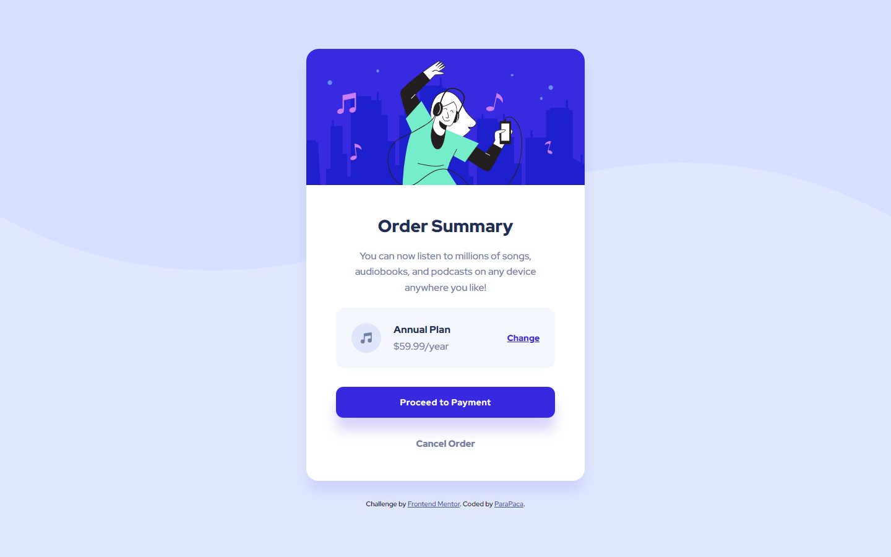

# Frontend Mentor - Order summary card solution

This is a solution to the [Order summary card challenge on Frontend Mentor](https://www.frontendmentor.io/challenges/order-summary-component-QlPmajDUj). Frontend Mentor challenges help you improve your coding skills by building realistic projects. 

## Table of contents

- [Overview](#overview)
  - [The challenge](#the-challenge)
  - [Screenshot](#screenshot)
  - [Links](#links)
- [My process](#my-process)
  - [Built with](#built-with)
  - [What I learned](#what-i-learned)
  - [Continued development](#continued-development)
  - [Useful resources](#useful-resources)
- [Author](#author)

## Overview

### The challenge

Users should be able to:

- See hover states for interactive elements

### Screenshot



### Links

- Solution URL: [https://github.com/ParaPaca/frontend-mentor/tree/main/Order-summary](https://github.com/ParaPaca/frontend-mentor/tree/main/Order-summary)
- Live Site URL: [https://parapaca.github.io/frontend-mentor/Order-summary/](https://parapaca.github.io/frontend-mentor/Order-summary/)

## My process

### Built with

- Semantic HTML5 markup
- CSS custom properties
- Flexbox
- CSS Grid
- Mobile-first workflow
- SCSS

### What I learned

This time I tried to delve deeper into the topic of clamp. I am proud of what I have achieved, but I am not going to stop there.

This project also became additional practice for me in using grid.

```css
  .subscription-wrapper {
    width: 100%;
    display: grid;
    grid-template-columns: 48px 1fr auto;
    align-items: center;
    justify-items: flex-start;
  }

  .container {width: clamp(320px, 100%, 450px);}

  .hero-img {height: clamp(160px, 30vw, 220px);}

  .card-wrapper {padding: clamp(35px, 6vw, 52px) clamp(24px, 6vw, 48px);}
```

### Continued development

I plan to continue learning about grid and clamp, and I'm also going to delve deeper into topics like z-index and position absolute and relative.

### Useful resources

- [W3Schools](https://www.w3schools.com/) - Always helping me, when I'm stuck in my projects for different reasons.
- [MDN](https://developer.mozilla.org/en-US/) - Also very useful site.

## Author

- Website - [ParaPaca](https://github.com/ParaPaca)
- Frontend Mentor - [@ParaPaca](https://www.frontendmentor.io/profile/ParaPaca)
- Twitter - [@ParaPaca](https://www.twitter.com/ParaPaca)
