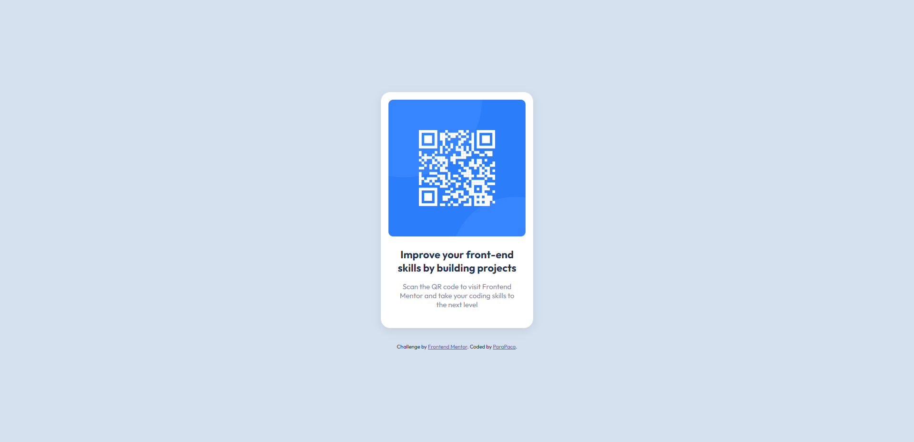

# Frontend Mentor - QR code component solution

This is a solution to the [QR code component challenge on Frontend Mentor](https://www.frontendmentor.io/challenges/qr-code-component-iux_sIO_H). Frontend Mentor challenges help you improve your coding skills by building realistic projects. 

## Table of contents

- [Overview](#overview)
  - [Screenshot](#screenshot)
  - [Links](#links)
- [My process](#my-process)
  - [Built with](#built-with)
  - [Continued development](#continued-development)
- [Author](#author)

## Overview

### Screenshot

### Links

- Solution URL: [https://github.com/ParaPaca/frontend-mentor/tree/main/QR-code](https://github.com/ParaPaca/frontend-mentor/tree/main/QR-code)
- Live Site URL: [https://parapaca.github.io/frontend-mentor/QR-code/](https://parapaca.github.io/frontend-mentor/QR-code/)

## My process

### Built with

- Semantic HTML5 markup
- SCSS
- Flexbox

### Continued development

This project has become not only an excellent opportunity for me to apply HTML and CSS knowledge but also a stimulus for further professional growth. After completing this project, I plan to:

**Deepen Frontend Development Knowledge:**
Deepen my understanding of frontend development, focusing on the fundamental principles of browser functionality and web application optimization.

**Learn Popular Frameworks:**
Master React, Angular, and Vue.js to have the ability to create scalable and interactive user interfaces.

**Dive Deeper into Preprocessors and Styling Libraries:**
Enhance my skills in working with SCSS and understand how to effectively apply it in development. Explore Bootstrap and other styling libraries to expedite the layout and styling process.

**Participate in Real Projects:**
Apply the acquired knowledge in practice by participating in real projects or contributing to open-source initiatives. This will help me gain a deeper understanding of development processes and face real-world challenges.

**Stay Updated with Modern Trends:**
Stay informed about the latest trends and innovations in the field of web development, keeping an eye on new language features and tools to ensure that my code remains modern and efficient.

## Author

- Website - [https://github.com/ParaPaca](https://github.com/ParaPaca)
- Frontend Mentor - [@ParaPaca](https://www.frontendmentor.io/profile/ParaPaca)
- Twitter - [@ParaPaca](https://www.twitter.com/ParaPaca)

