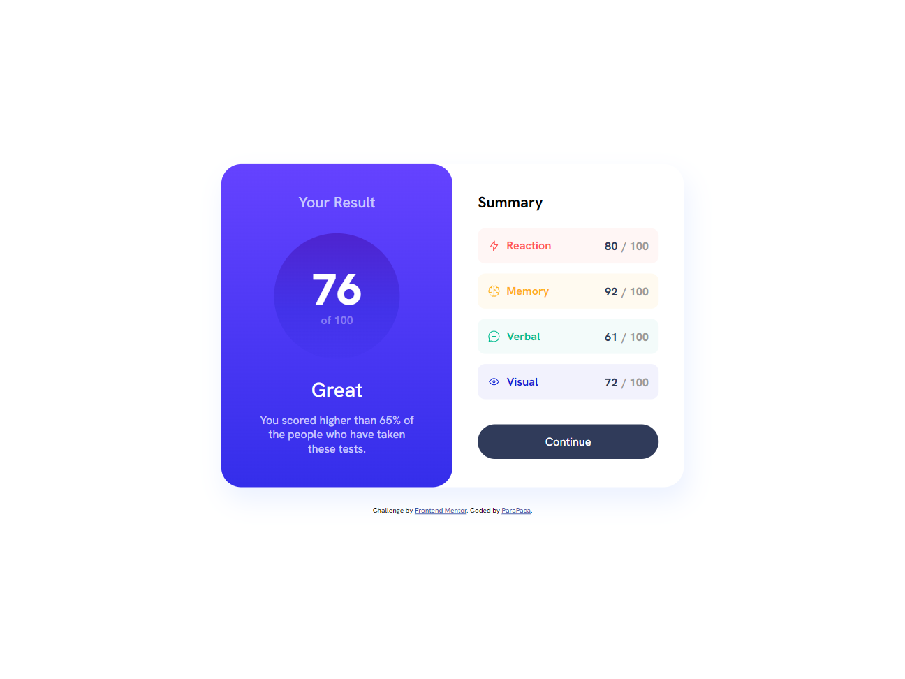

# Frontend Mentor - Results summary component solution

This is a solution to the [Results summary component challenge on Frontend Mentor](https://www.frontendmentor.io/challenges/results-summary-component-CE_K6s0maV). Frontend Mentor challenges help you improve your coding skills by building realistic projects. 

## Table of contents

- [Overview](#overview)
  - [The challenge](#the-challenge)
  - [Screenshot](#screenshot)
  - [Links](#links)
- [My process](#my-process)
  - [Built with](#built-with)
  - [Useful resources](#useful-resources)
- [Author](#author)
- [Acknowledgments](#acknowledgments)

## Overview

### The challenge

Users should be able to:

- View the optimal layout for the interface depending on their device's screen size
- See hover and focus states for all interactive elements on the page
- **Bonus**: Use the local JSON data to dynamically populate the content

### Screenshot

### Links

- Solution URL: [https://github.com/ParaPaca/frontend-mentor/tree/main/Results-summary](https://github.com/ParaPaca/frontend-mentor/tree/main/Results-summary)
- Live Site URL: [https://parapaca.github.io/frontend-mentor/Results-summary/](https://parapaca.github.io/frontend-mentor/Results-summary/)

## My process

### Built with

- Semantic HTML5 markup
- CSS custom properties
- Flexbox
- CSS Grid
- Mobile-first workflow
- [SCSS](https://sass-lang.com/) - CSS extension
- [JQuery](https://jquery.com/) - JS library
- [Handlebars](https://handlebarsjs.com/) - JS library

### Useful resources

- [JQuery Documentation](https://api.jquery.com/category/manipulation/) - This helped me understand the jquery methods and write my code.
- [W3Schools](https://www.w3schools.com/) - Always helping me, when I'm stuck in my projects for different reasons.

## Author

- Website - [ParaPaca](https://github.com/ParaPaca)
- Frontend Mentor - [@ParaPaca](https://www.frontendmentor.io/profile/ParaPaca)
- Twitter - [@ParaPaca](https://www.twitter.com/ParaPaca)
